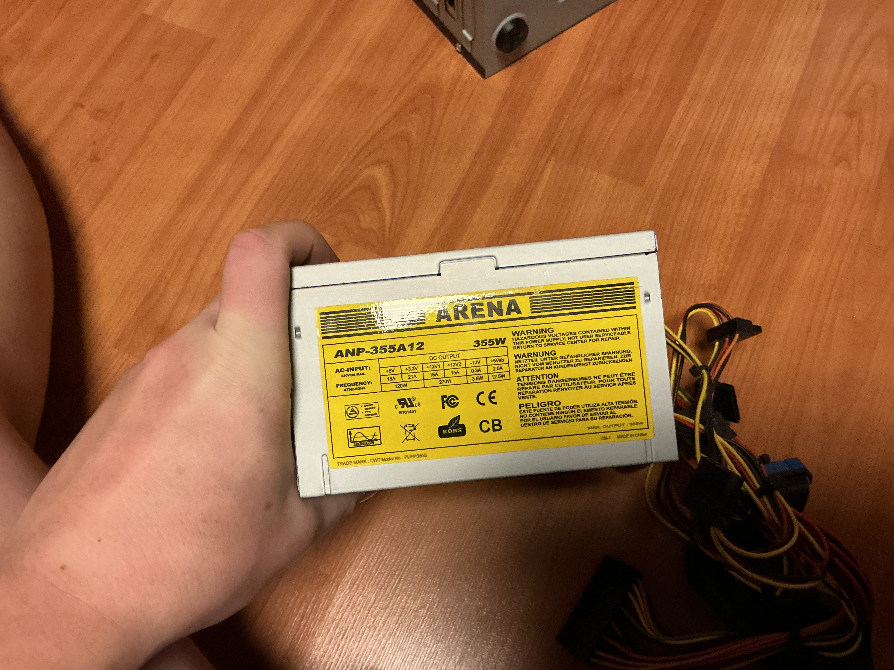
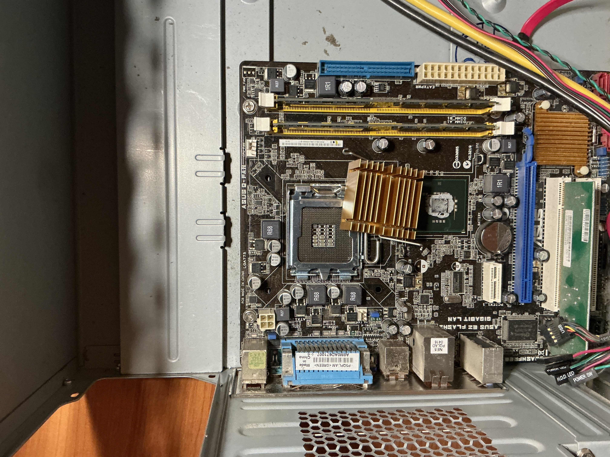
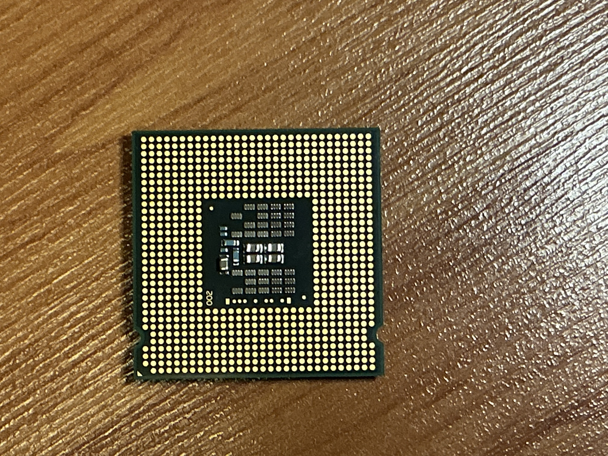

# Flegl-ročníkový projekt
## Cíl
Cílem projektu je provést kompletní, bezpečné a zdokumentované rozebrání dvou stolních počítačů a následně porovnat jejich součástky. Projekt slouží jako praktická příručka pro pochopení vnitřní struktury PC, fungování jednotlivých komponentů

## Zadání
Mým úkolem bylo vybrat si projekt, který souvisí s mým oborem a zároveň mi umožní něco si prakticky vyzkoušet.

### Tým 
Pracoval jsem na tom částečně sám s pomocí táty.

### Proč jsem si to vybral
Zvolil jsem si toto téma, protože jsem chtěl zjistit, jaký počítač měl můj děda, jaké komponenty obsahoval a v jakém je stavu. Zároveň jsem chtěl, aby táta věděl, jak počítač funguje a co se v něm nachází.

## PŘÍPRAVA
Příprava byla poměrně jednoduchá.

#### Potřeboval jsem:

křížový šroubovák,

dobré osvětlení,

oba počítače, které jsem chtěl rozebírat.

Protože mám doma nastavitelné světlo, nastavil jsem 5000 K, aby bylo neutrální a dobře se mi pracovalo. Při přípravě jsem si také přečetl pár rad a postupů, ve kterých mi pomohla také AI.

## DEMONTÁŽ
### 1)krok 
Nejprve jsem u obou počítačů sundal boční kryt.
Použil jsem křížový šroubovák a při některých šroubcích bylo potřeba použít i trochu síly, protože byly staré a utažené více, než je dnes běžné.

### 2)krok
#### První vizuální kontrola

Zkontroloval jsem množství prachu.

Ověřil jsem, zda nejsou kabely poškozené.

### 3)krok Odpojení kabeláže
Ujistíme se, že jste odpojili napájecí kabely (včetně těch vedoucích k disku a optické mechanice) a datové kabely (SATA).
### 4)krok
#### Vyjmutí úložiště a optické mechaniky
Pevný disk = Vyjmuli jste pevný disk (HDD). Jde o model Western Digital Caviar Black s kapacitou 750 GB, který používá rozhraní SATA.
Optická mechanika = Vyjmuli jste Sony Optiarc DVD±RW mechaniku (AD-5260S), která také používá rozhraní SATA.
### 5)krok
#### Vyjmutí Ram
Vyjmuli jsme dvě  paměti Kingston KVR (ValueRAM).Jedná se o starší typ pamětíb pravděpodobně DDR2.
### 6)krok
#### Vyjmutí Karet a Zdroje
Dále jsem pokračoval odšroubováním síťové karty TP-Link, která poskytuje konektor RJ-45 pro připojení k síti.
Následně jsem odstranil Zdroj
### 7)krok
#### Vyjmutí základní desky
Vyjmutí šlo tak hladce ,ale nakonec jsem to zvládl. Jedná se o model ASUS P5QL-E. Má patici LGA 775 pro procesor a sloty pro RAM (žluté). Deska je již v této fázi demontáže bez pamětí RAM, grafické karty a procesoru.
Zadní panel (I/O Shield): Je vidět zadní I/O panel se staršími porty jako jsou PS/2, (zelený/fialový) pro klávesnici/myš, sériový port (modrý), paralelní port (fialový), USB porty a audio konektory.
Procesor (CPU): Procesor jsem vyndal z patice na základní desce. Procesor je na fotce otočený (vidíme kontaktní piny – jde tedy o starší typ CPU, Intel Core 2 Duo/Quad pro patici LGA 775, což odpovídá desce ASUS P5QL-E).

  

---

🔴 1. Horní levý kroužek
**CMOS baterie**
* **Už víš:** CMOS baterie (CR2032)
* **Funkce:** Napájí BIOS/CMOS paměť a hodiny
* **Význam:** Udržuje čas a nastavení BIOSu při vypnutém PC
---

🔴 2. Spodní levý kroužek
**Sloty pro RAM (operační paměť)**
* **Použití:** Sem se vkládají RAM moduly
* **Funkce:** Slouží k dočasnému ukládání dat, se kterými procesor právě pracuje
* **Důležité:** Bez RAM by se PC vůbec nespustil

---

 🔴 3. Pravý kroužek
**Napájecí konektor základní desky (ATX 24pin)**
* **Zdroj:** Hlavní napájení základní desky ze zdroje
* **Přivádí napětí pro:**
    * Základní desku
    * RAM
    * Sloty (PCIe apod.)
### 8)krok
#### Kompletní rozložení PC
Postup jste dodržel správně. Po demontáži máte následující dílčí části, které byly identifikovány na fotkách:

Skříň (Case),

Základní panel,   Ukazuje konektory pro připojení externích zařízení: PS/2 pro klávesnici/myš, VGA a D-Sub (na desce), LPT (paralelní port),USB, Ethernet (síť) a zvukové konektory (Audio Jacks).

Zdroj (ARENA 355W),   Převádí střídavý proud ze zásuvky na stejnosměrný proud s různým napětím, které je potřeba k napájení všech komponent v počítači. Model ARENA ANP-355A12 s výkonem 355W.

Základní deska (ASUS P5QL-E, bez CPU/RAM),    Deska, ke které se připojují všechny ostatní komponenty (procesor, paměti, disky, karty). Je to hlavní okruh počítače, který umožňuje všem dílům komunikovat. Je to na model ASUS P5QL-E nebo podobný z éry patice LGA 775 a pamětí DDR2.  

CPU (Procesor, piny dolů),   "Mozek" počítače. Provádí veškeré výpočty a zpracovává instrukce programů. Dle patice na desce je to procesor pro patici LGA.

RAM (Dva moduly Kingston),    Paměť pro dočasné ukládání dat a programových instrukcí, které CPU aktuálně potřebuje. Rychlý přístup k datům zajišťuje plynulý chod aplikací. Jedná se o moduly Kingston KVR (ValueRAM), pravděpodobně typu DDR2, soudě dle desky. 

HDD (Western Digital 750GB SATA 3.5"),    Trvalé úložiště pro operační systém, programy a soubory uživatele. Kapacita je 750 GB, model Western Digital WD7500HAALS (WD Caviar Black), s rozhraním SATA.

Optická mechanika (Sony Optiarc SATA),    Zařízení pro čtení a zápis dat na optické disky, jako jsou CD a DVD. Jedná se o Sony Optiarc AD-5260S DVD vypalovačku s rozhraním SATA.

Síťová karta (TP-Link)     Umožňuje počítači připojení k síti (např. domácí router nebo internet) pomocí síťového kabelu (konektor RJ-45). Jedná se o kartu TP-Link pro slot PCI.

Ventilátor (AVC): Systémový ventilátor (model DS08025B12U) s kuličkovým ložiskem (DC 12V, 0.70A) připojený přes 4-pinový konektor pro regulaci otáček.

  
  
  
  
  
  

## VIDEO
https://youtu.be/LrG_JW2O2Qw
### CITACE
Pomoc táty a umělé inteligence google Gemii.

GEMII, Google. Rozhovor s modelem Gemini na téma rozebírání počítačů. Online. Gemini (Google AI). 2025, roč. 2025, č. 12, s. 1. Dostupné z: Gemii, https://gemini.google.com/. [cit. 2025-12-19].

